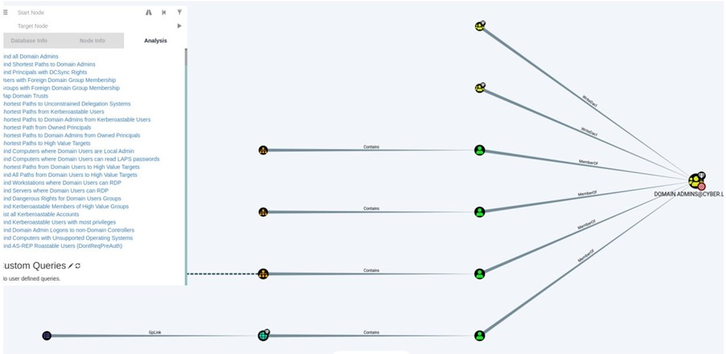

### **Active Directory Attack Path – Red Team Lab**

# **Attack Path Overview

The diagram above shows shortest attack path from a compromised user account to Domain Admin privileges, identified using Bloodhound.
It highlights key relationships and misconfigurations that allow privilege escalation within Active Directory environment.

Overview

This project demonstrates a simulated compromise of an Active Directory environment, starting from initial access to full domain compromise using common red team techniques.

Lab Environment

- Windows Server (Domain Controller)
- Windows 10 Client
- Kali Linux
- Tools: BloodHound, PowerView, Rubeus, Mimikatz, Impacket

Attack Path Summary

1. Initial access via compromised Windows client
2. Domain enumeration using PowerView and BloodHound
3. Identification of AS-REP roastable account
4. Credential extraction and password cracking
5. Lateral movement using PsExec
6. Privilege escalation to Domain Admin
7. Domain compromise and persistence (Golden Ticket)

Key Techniques

- Active Directory enumeration
- AS-REP Roasting
- Credential dumping
- Lateral movement
- Golden Ticket attack

Key Takeaways

- Misconfigurations in Active Directory can lead to full domain compromise
- Attack paths are more important than single vulnerabilities
- Proper monitoring and hardening can prevent most of these attacks

Disclaimer

This project was conducted in a controlled lab environment for educational purposes only.
